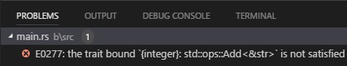
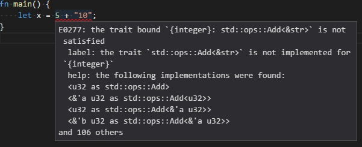

# Linting In Legacy Mode

Executing a cargo command makes the extension parse the the command's output and show diagnostics.

Legacy Mode cannot show diagnostics as you type, for that you should use [RLS Mode](../rls_mode/linting.md).

Let's assume we have the following code:

```rust
fn main() {
    let x = 5 + "10";
}
```

We then execute any cargo command. Let's execute ["Cargo: Build"](../cargo_command_execution.md).

It builds and shows diagnostics:

* In the source code:

[]()

* And In the Problems panel:

[]()

We can hover over any diagnostic to see what it is:

[]()
