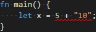
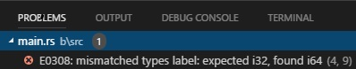

# Linting Page

The extension provides linting as shown in the following screenshot:

[]()

It also populates the Problems panel.

For the code:

```rust
fn foo(i: i32) {}

fn main() {
    foo(2i64);
}
```

The Problems panel would look like:

[]()

Linting behaves differently in [RLS Mode](rls_mode/linting.md) than in [Legacy Mode](legacy_mode/linting.md).
